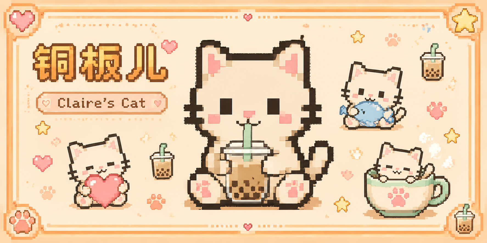
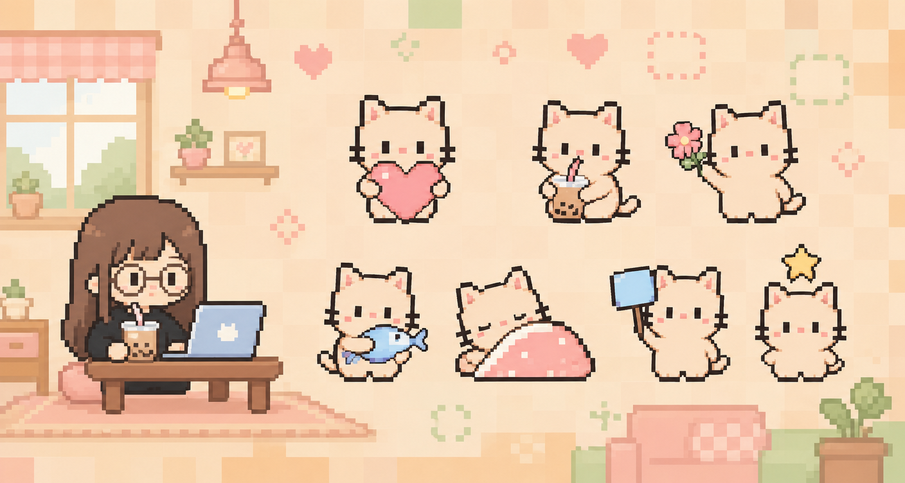
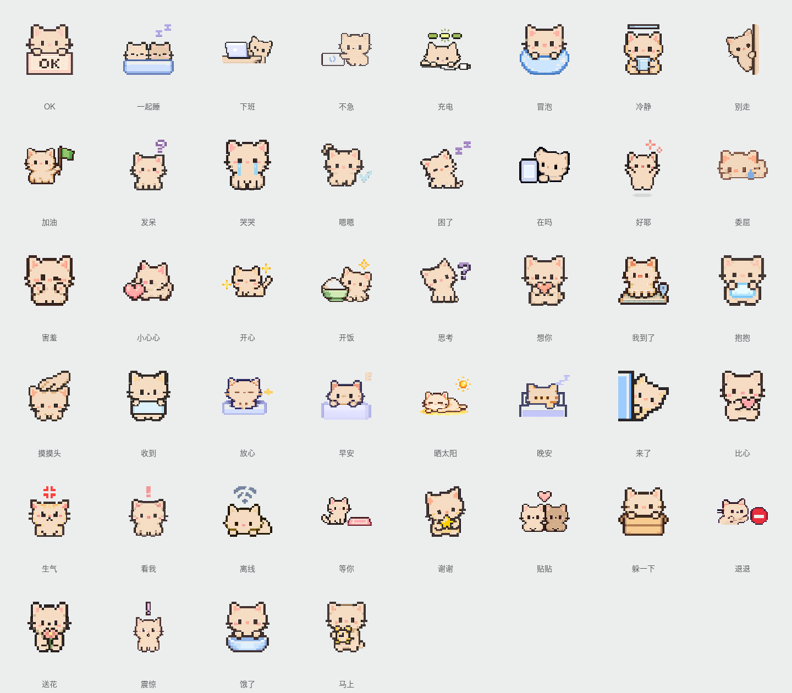

# Pixel Mini Cat

「像素奶茶小猫」是一套微型像素表情包：透明背景、小动作、小道具，适合日常聊天、贴贴、收到、晚安和一点点发呆。

<p align="center">
    
</p>

## Preview

<p align="center">
    
</p>

<p align="center">
    
</p>

## Structure

```text
pixel-mini-cat/
├── docs/
│   ├── design.md
│   ├── prompt.md
│   ├── scenes.md
│   ├── like-prompt.md
│   └── thanks-prompt.md
├── previews/
│   ├── preview-sheet.png
│   └── showcase/
└── stickers/
    ├── release-01/
    ├── release-02/
    └── extras/
```

先读 `docs/design.md`，再从 `docs/scenes.md` 选场景，套入 `docs/prompt.md` 生成。最终公开图放进 `stickers/`，预览合集放进 `previews/`。
